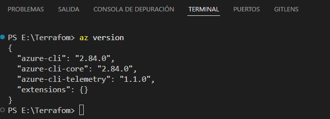

# Apuntes de Terraform

## Version de contenedores 

~> : significa que se mantendría la version : 3.0.x 

1. Previamente tenemos que cargar un msi cli de azure, hay diferentes maneras de instalarlo, en mi caso utilicé powershell. 
 --> https://learn.microsoft.com/es-es/cli/azure/install-azure-cli-windows?view=azure-cli-latest&pivots=msi-powershell

2. Comprobamos que funciona correctamente ejecutando en nuestro terminal. 
         "az version"
         